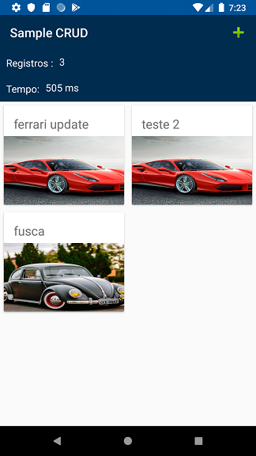
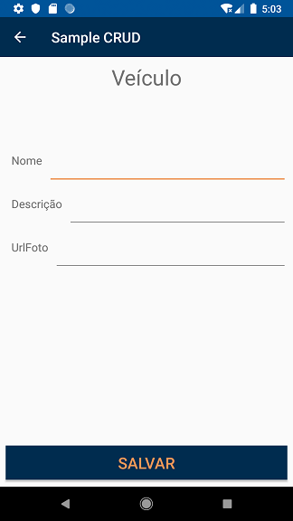

# Sample CRUD - Kotlin

## Dependencias

Exemplo basico de utilização de crud com armazenamento local.

- Android Jetpack
	- Utilizado ROOM Database para persistencia local de dados
- Picasso
	- Automação no download e processamento de imagem
- Anko
	- Otimização de layouts e chamadas assincronas 
	
	

### Screenshot 

